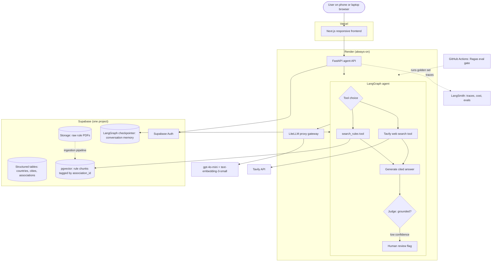

# Submission

## Problem

Umpires, captains, and officials at local cricket associations need to combine detailed, association-specific and format-specific playing conditions and by-laws, written as individual rule statements rather than worked scenarios, into a correct ruling in the moment during a live match, but today they can only rely on memory from occasional training, dense PDF rule documents that are hard to consult on a phone, and ad hoc calls to a match-day contact, which leads to inconsistent or wrong rulings under pressure.

## Why this is a problem

I umpire local cricket myself, and the people who carry this problem are umpires first, then the captains and club officials who lean on them for a ruling. An umpire on the field has to apply the correct playing conditions for that specific association and that specific format, senior, junior, or women's, and often has to combine two or three separate rule clauses into one ruling on the spot. A junior over might end at six legal balls or eight balls in total, whichever comes first, and the documents never spell out what happens if the eighth ball is a no-ball and a free hit is owed. A time-lost calculation after a late start has to be combined with an over-rate penalty later in the same innings. None of this is answered by reading one rule on its own.

Right now the only preparation umpires get is a handful of training meetings a year and weekly notes from the association's umpire development officer, and none of it is scenario based, it is general reminders. Detailed situations like rain rules get handed out as printed sheets that nobody can memorize, and when an umpire needs to check something mid match, the rule documents are dense PDFs that are hard to read on a phone, especially for older umpires who rarely carry a laptop to the ground. The fallback is a phone call to whoever is the match-day contact that day. I have watched this go wrong in front of me. At a senior MYCA match, play started six minutes late, which should have meant one over off each side. The bowling side then ran over time and should have lost a further over for slow over rate on top of that. Both captains argued opposite interpretations, the umpire had no way to check the actual rule in the moment, and the ruling that came out was wrong. The calculation itself is simple. Getting it right under live pressure with only memory and a phone call to fall back on is not.

## Solution

I am building an AI assistant that answers umpires, captains, and officials from the rule documents of whichever cricket association they are working with, with citations to the specific document and section, and an honest fallback when a question falls outside those documents.

## Infrastructure

### Why each component

1. **LLM: gpt-4o-mini** - cheap enough to serve as both generator and judge, and it is the model I have used all cohort, so its behavior with my prompts and evals is a known quantity.
2. **Agent orchestration: LangGraph** - the judge-retry loop, honest fallback, and human review path need an explicit graph with state, not a linear chain.
3. **Tools: search_rules + Tavily** - search_rules retrieves rule chunks hard-filtered by association_id so the agent can only see the right association's rules, and Tavily covers current public questions the rule documents cannot answer.
4. **Embedding model: text-embedding-3-small** - cheap, proven in my earlier retrieval work, and low lock-in since swapping later only costs re-embedding the corpus.
5. **Vector database: Supabase pgvector** - vectors live in the same Postgres as my existing association tables, so one foreign key joins structured data, chunks, and files with no second database to run or pay for.
6. **Monitoring: LangSmith** - every agent run is traced with latency, token cost, and judge score, which is how I debug retrieval instead of guessing.
7. **Evaluation framework: Ragas + GitHub Actions** - Ragas scores faithfulness, context precision, context recall, and answer relevance against a golden set, and a CI gate fails any change that drops faithfulness below baseline.
8. **User interface: Next.js on Vercel** - a responsive web app satisfies the phone-and-laptop browser requirement with one codebase.
9. **Deployment: Render + Vercel** - the agent API and gateway run always-on on Render so there are no cold starts, and Vercel serves the frontend from its free tier.
10. **LLM gateway: LiteLLM proxy** - run as a service, not an SDK import, it gives every model call retries, fallbacks, budget caps, and one place where all traffic is logged.
11. **Memory: LangGraph Postgres checkpointer** - conversation state persists in Supabase keyed by thread id, so follow-up questions resolve against prior turns.
12. **Auth: Supabase Auth** - the API verifies the JWT the platform already issues, reusing existing auth instead of building any.
13. **File storage: Supabase Storage** - raw rule PDFs live in a bucket keyed by association_id, kept for re-ingestion and document versioning.

## Evaluation questions

| # | Question | Expected answer | Source |
|---|----------|------------------|--------|
| 1 | Umpire: "We started 6 minutes late today, batting side reckons they should still get the full 35 overs. What do I actually give them?" | Deduct overs for time lost at MYCA's rate of 1 over per 4 minutes lost, so 6 minutes lost means 1 over off, 34 overs allowed. If the bowling side then goes over its allotted time for those 34 overs, apply a separate over-rate deduction on top of the time-lost deduction. | MYCA Senior Playing Conditions |
| 2 | Umpire: "In U13 does the over end at 6 balls or 8 balls, and what if most of those extra balls are wides?" | The over ends at whichever limit is reached first, 6 legal deliveries or 8 balls bowled in total. Wides and no-balls count toward the 8-ball cap, so an over full of wides can end before 6 legal deliveries are bowled. | MYCA Junior Playing Conditions |
| 3 | Umpire: "If the 8th ball in a junior over turns out to be a no-ball, does the batter still get a free hit, or has the over already ended?" | The junior playing conditions set the 8-ball cap and the no-ball/free hit rule separately, but do not state which one governs when they collide on the same delivery. | not in rules - expect honest fallback |
| 4 | Captain: "If it rains after 20 overs and we can't finish, how do we decide the winner?" | MYCA Senior Playing Conditions sets out a run-rate based revised target method for interrupted one-day matches, applied once a minimum number of overs per side has been bowled. | MYCA Senior Playing Conditions |
| 5 | Parent: "My son's in the U13s, why do their overs sometimes run longer than 6 balls, is that even allowed?" | Yes. Junior grade overs can run up to 8 balls if there are wides or no-balls, because the over only ends once 6 legal deliveries or 8 total balls have been bowled, whichever comes first. | MYCA Junior Playing Conditions |
| 6 | Umpire: "Does the women's one-day comp use the same powerplay overs as the senior comp?" | No. MYCA Women's Playing Conditions sets its own powerplay length and fielding restrictions, which differ from the senior grade. | MYCA Women's Playing Conditions |
| 7 | Captain: "One of our players wants to transfer in from another club mid-season so he can play finals with us, can we do that?" | MYCA By-Laws set a transfer window during the season and a cut-off date before which a player must be registered to be eligible for finals. A transfer after that date is not eligible for finals. | MYCA By-Laws |
| 8 | Club official: "What's the fine if we forfeit a match with less than 24 hours notice?" | MYCA By-Laws set a fixed forfeit fine for late notice, higher than the fine for a forfeit notified before the cut-off. | MYCA By-Laws |
| 9 | Umpire: "A captain reckons MCC Laws say an over is always 6 balls, full stop, so we should ignore the 8-ball cap for U13. Is he right?" | No. MYCA's own junior playing conditions set the 8-ball cap for that grade, and that local rule overrides the general MCC default of a 6-ball over. | MYCA Junior Playing Conditions (overrides MCC Law default) |
| 10 | Captain: "Does the follow-on rule apply if we bowl the other team out cheaply in our one-day comp?" | Follow-on is a multi-innings concept that does not exist in MYCA's one-day playing conditions for any grade. | not in rules - expect honest fallback |
| 11 | Captain: "Is it going to rain Saturday at our home ground, should we plan for a delayed start?" | Requires a live weather forecast for the specific ground and date, which the rule documents don't contain. | public web - expect Tavily route |
| 12 | Umpire: "I heard Cricket Australia changed the concussion substitute rule this season, does that apply to our grade?" | Requires checking Cricket Australia's current published policy and whether MYCA has adopted it, since the association's own documents may not yet reflect a recent national rule change. | public web - expect Tavily route |
| 13 | Parent: "My daughter's 12. Can she play in the boys U13 team if our club doesn't have a girls team this year?" | MYCA By-Laws set eligibility for girls to play in the corresponding boys grade when no girls team is fielded by their club, subject to age and grade limits. | MYCA By-Laws |
| 14 | Umpire: "Ball hits the sightscreen on the full, is that a six or do I call dead ball?" | MYCA Senior Playing Conditions treats a full-pitched hit into the sightscreen as a boundary six at grounds without a boundary rope, unless that ground's specific conditions state otherwise. | MYCA Senior Playing Conditions |

## Data Strategy

### Chunking strategy

I am using structure-aware chunking, not fixed-size blind chunking. Each of MYCA's documents already has its own numbering scheme, and I split on that instead of on a raw token count. The Junior document uses flat labels, J1 through J25. The Senior Men's and Senior Women's documents use a decimal hierarchy, section down to sub-clause, for example 5.3.3. A chunk boundary always falls on one of these section breaks, so a retrieved chunk is a complete rule, not half of one.

Within that constraint I target roughly 500 to 800 tokens per chunk, with about 15 percent overlap, 100 to 120 tokens, between adjacent chunks. MYCA's own rules cross-reference each other constantly. Rule 5.3.3 in the Senior Men's document sets overs and time penalties and then points at the Appendix B table for the exact numbers. Without overlap, a chunk containing the penalty clause could get separated from the table it depends on, and the agent would answer with half the rule.

Tables get special handling. Appendix B in both Senior documents, the overs-reduction table for time lost to rain, is about 70 rows mapping accumulated minutes lost to overs lost, running from 0 up to 280 minutes. If a chunk boundary cut through that table, a chunk covering only the first half would silently have no answer, or the wrong nearby answer, for a real question like "we lost 150 minutes today, how many overs do we lose." So every table, the Appendix B overs-reduction table, the Appendix A fines table, the junior bowling-restriction table in J16, and the over-rate schedule in J15, is extracted and kept as one chunk each, tagged as a table, and never split even if that chunk runs over the target size. A partial table is worse than no table.

The three playing-conditions documents cover different grades and genders, and they genuinely disagree with each other, not just in numbers but in which rules exist at all. The Senior Women's document has a clause capping an over at 8 total balls, 6 legal deliveries or 8 balls including extras, whichever comes first. That clause does not exist anywhere in the Senior Men's document. If retrieval pulled from both documents without distinguishing them, a senior men's query could surface a women's-only rule as if it applied, which is exactly the kind of wrong answer this project exists to prevent. So every chunk carries a grade_scope tag, junior, senior_men, or senior_women, and retrieval filters on it alongside association_id.

The two forms, the Player Conduct Report and the Suspect Bowling Action form, are not rules text, they are short operational documents: tick-box sections and a set of instructions for who to email and within what deadline. I chunk each form as one procedural chunk covering the instructions, plus one chunk per structured section, for example the Level 1 tick-box section separate from the Level 2 tick-box section on the conduct report. These are short documents, so this produces only a handful of chunks total. They go into the same pgvector table and are retrieved through the same single retrieval tool as the rules documents, not a separate tool, because the project's Task 2 commitment was one retrieval tool scoped by association_id, and a second tool for two small forms would add agent complexity without real benefit at this scale. They are distinguished purely by a document_type tag set to form, so a rules question about no-balls never surfaces a form chunk, and a question like "what do I do if I suspect an illegal bowling action" retrieves the form's procedure text instead of rules text.

Every chunk carries the same metadata regardless of document: association_id, document_type (rules or form), grade_scope (junior, senior_men, or senior_women), section_number, and content_type (rule_text, table, or procedure). This is what lets the retrieval tool answer correctly: a senior women's overs question never surfaces a junior chunk, and a rules question never surfaces a form chunk.

### Data source and external API

The data source is MYCA's own documents: the three playing-conditions documents, Junior, Senior Men's, Senior Women's, and the two operational forms. They are stored as PDFs in Supabase Storage, chunked as described above, and embedded into a pgvector table scoped by association_id, using OpenAI's text-embedding-3-small model at 1536 dimensions. I chose that model over text-embedding-3-large because it gives strong retrieval quality for this kind of structured, moderate-length domain text at a fraction of the cost, and because each association's corpus is only a handful of PDFs, so the larger model's extra dimensionality buys almost nothing while roughly doubling embedding cost and pgvector storage, a cost that compounds once more associations are added to the platform.

The external API is Tavily. It handles two different kinds of question MYCA's own documents don't cover. The first is current public information that isn't in the PDFs, like weather on a given match day. The second is basic Laws of Cricket questions that MYCA's playing conditions assume rather than define. Both the Junior and Senior documents open by stating that the Laws of Cricket apply to all matches unless a rule excludes or modifies them, which means the documents only ever spell out where MYCA differs from the Laws, never the Laws themselves. A question like what counts as an LBW dismissal, what a no ball or a wide or a dead ball is, or how an umpire signals a short run, has no answer anywhere in MYCA's corpus, because that corpus was never written to teach the base game. For this second kind of question the agent draws on the model's own general cricket knowledge together with Tavily, rather than searching a corpus that was never meant to hold the answer.

The two sources interact in a fixed order. Local retrieval is always attempted first, because the entire premise of this project is that an association's own playing conditions override general or public cricket knowledge where the two overlap. The Route decision in the agent workflow sends rules questions to local retrieval first, and the Found check decides whether that retrieval turned up something relevant. Only a genuine miss, whether that's a question the association's documents are silent on, a current public-information question, or a base Laws of Cricket question the documents assume without defining, falls through to Tavily and general knowledge, or to the honest fallback if nothing usable comes back.
