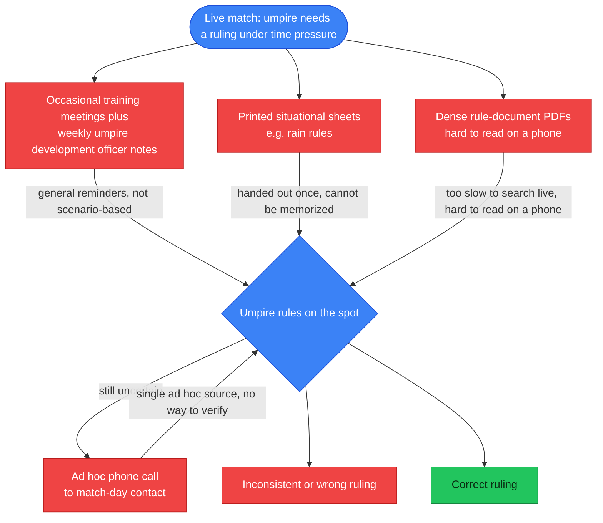
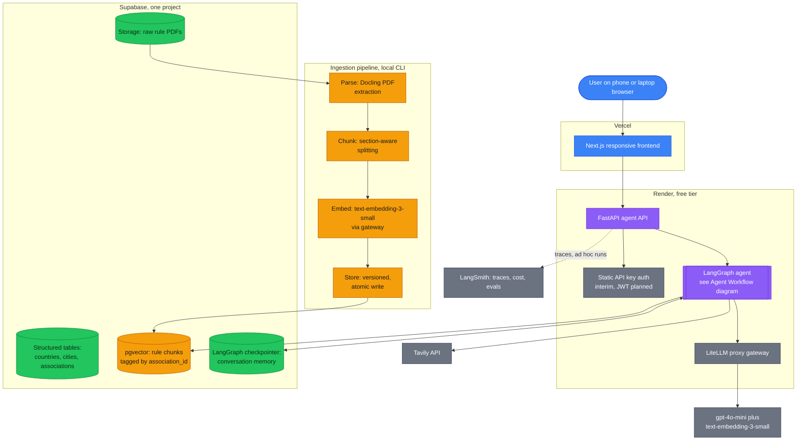
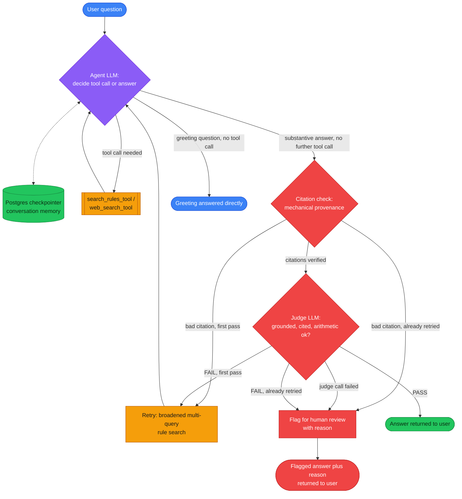

# Submission

## Problem

Umpires, captains, and officials at local cricket associations need to combine detailed, association-specific and format-specific playing conditions and by-laws, written as individual rule statements rather than worked scenarios, into a correct ruling in the moment during a live match, but today they can only rely on memory from occasional training, dense PDF rule documents that are hard to consult on a phone, and ad hoc calls to a match-day contact, which leads to inconsistent or wrong rulings under pressure.

## Why this is a problem

I umpire local cricket myself, and the people who carry this problem are umpires first, then the captains and club officials who lean on them for a ruling. An umpire on the field has to apply the correct playing conditions for that specific association and that specific format, senior, junior, or women's, and often has to combine two or three separate rule clauses into one ruling on the spot. A junior over might end at six legal balls or eight balls in total, whichever comes first, and the documents never spell out what happens if the eighth ball is a no-ball and a free hit is owed. A time-lost calculation after a late start has to be combined with an over-rate penalty later in the same innings. None of this is answered by reading one rule on its own.

Right now the only preparation umpires get is a handful of training meetings a year and weekly notes from the association's umpire development officer, and none of it is scenario based, it is general reminders. Detailed situations like rain rules get handed out as printed sheets that nobody can memorize, and when an umpire needs to check something mid match, the rule documents are dense PDFs that are hard to read on a phone, especially for older umpires who rarely carry a laptop to the ground. The fallback is a phone call to whoever is the match-day contact that day. I have watched this go wrong in front of me. At a senior MYCA match, play started six minutes late, which should have meant one over off each side. The bowling side then ran over time and should have lost a further over for slow over rate on top of that. Both captains argued opposite interpretations, the umpire had no way to check the actual rule in the moment, and the ruling that came out was wrong. The calculation itself is simple. Getting it right under live pressure with only memory and a phone call to fall back on is not.

### How umpires solve this today

## Solution

I am building an AI assistant that answers umpires, captains, and officials from the rule documents of whichever cricket association they are working with, with citations to the specific document and section, and an honest fallback when a question falls outside those documents.

## Infrastructure

### Why each component

1. **LLM: gpt-4o-mini** - cheap enough to serve as both generator and judge, and it is the model I have used all cohort, so its behavior with my prompts and evals is a known quantity.
2. **Agent orchestration: LangGraph** - the judge-retry loop, mechanical citation check, honest fallback, and human review path need an explicit graph with state, not a linear chain.
3. **Tools: search_rules + Tavily** - search_rules retrieves rule chunks hard-filtered by association_id so the agent can only see the right association's rules, and Tavily covers current public questions the rule documents cannot answer.
4. **Embedding model: text-embedding-3-small** - cheap, proven in my earlier retrieval work, and low lock-in since swapping later only costs re-embedding the corpus.
5. **Vector database: Supabase pgvector** - vectors live in the same Postgres as my existing association tables, so one foreign key joins structured data, chunks, and files with no second database to run or pay for.
6. **Monitoring: LangSmith** - traces every agent run with latency, token cost, and judge score when tracing env vars are set, though it's wired ad hoc for eval runs today, not default-on in the Render deployment yet.
7. **Evaluation framework: Ragas** - scores faithfulness, context precision, context recall, and answer relevancy against a 50-row golden set; a CI gate on this is designed but not yet wired.
8. **User interface: Next.js on Vercel** - a responsive web app satisfies the phone-and-laptop browser requirement with one codebase, live at lexisport-cricket-rule-agent.vercel.app.
9. **Deployment: Render + Vercel** - the agent API and gateway run on Render's free tier, and Vercel serves the frontend from its free tier too; free tier means both spin down after 15 minutes idle and take up to about a minute and a half to fully warm back up, a cold start I accepted for cert scope to keep this at zero cost.
10. **LLM gateway: LiteLLM proxy** - run as a service, not an SDK import, it gives every model call retries, fallbacks, budget caps, and one place where all traffic is logged, gated by a master key so it isn't an open relay on the public internet.
11. **Memory: LangGraph Postgres checkpointer** - conversation state persists in Supabase keyed by thread id, verified to survive across separate CLI processes, so follow-up questions resolve against prior turns.
12. **Auth: static API key (interim)** - the API checks a single shared key today; Supabase JWT verification is the planned swap, not yet implemented.
13. **File storage: Supabase Storage** - raw rule PDFs live in a bucket keyed by association_id, kept for re-ingestion and document versioning.
14. **Ingestion: Docling parsing, section-aware chunking** - Docling extracts layout, tables, and headings so chunks stay section-aware instead of a naive fixed-size split, and it fails loudly on a low-confidence, likely-scanned page instead of silently ingesting garbage. Runs as a local CLI today, not yet wired into the API.

The end-to-end prototype is built and deployed to a public endpoint: the frontend is live at [lexisport-cricket-rule-agent.vercel.app](https://lexisport-cricket-rule-agent.vercel.app), talking to the agent API and LiteLLM gateway running as two separate services on Render.

## Agent Workflow

The user's question enters the agent with full conversation history restored from the Postgres checkpointer, so a follow-up like "what if they fall short of that" resolves against the prior turn. The agent LLM decides on each pass whether it needs a tool: search_rules_tool for anything grounded in the association's own documents, including calculations that depend on a rule's numbers, or web_search_tool for current public information or another body's policy, and it can call both in the same turn when a question genuinely needs both. A bare greeting skips verification entirely and returns directly; every other non-tool-call answer, including one that never called a tool at all, goes to a citation check.

The citation check is a deterministic, zero-LLM pass that verifies every citation actually points at something retrieved this turn; only if that passes does the judge LLM run, checking groundedness, citation support, and arithmetic. A failure at either step triggers one retry with the question reformulated two extra ways and a broadened rule search, feeding the merged results back to the agent; a second failure, or a judge call that errors outright, is flagged for human review with the specific unsupported claim, fabricated citation, or check-failure reason attached, rather than either silently passing or blocking the answer entirely.

## Evaluation questions

| # | Question | Expected answer | Source |
|---|----------|------------------|--------|
| 1 | Umpire: "We started 6 minutes late today, batting side reckons they should still get the full 35 overs. What do I actually give them?" | Deduct overs for time lost at MYCA's rate of 1 over per 4 minutes lost, so 6 minutes lost means 1 over off, 34 overs allowed. If the bowling side then goes over its allotted time for those 34 overs, apply a separate over-rate deduction on top of the time-lost deduction. | MYCA Senior Playing Conditions |
| 2 | Umpire: "In U13 does the over end at 6 balls or 8 balls, and what if most of those extra balls are wides?" | The over ends at whichever limit is reached first, 6 legal deliveries or 8 balls bowled in total. Wides and no-balls count toward the 8-ball cap, so an over full of wides can end before 6 legal deliveries are bowled. | MYCA Junior Playing Conditions |
| 3 | Umpire: "If the 8th ball in a junior over turns out to be a no-ball, does the batter still get a free hit, or has the over already ended?" | The junior playing conditions set the 8-ball cap and the no-ball/free hit rule separately, but do not state which one governs when they collide on the same delivery. | not in rules - expect honest fallback |
| 4 | Captain: "If it rains after 20 overs and we can't finish, how do we decide the winner?" | MYCA Senior Playing Conditions sets out a run-rate based revised target method for interrupted one-day matches, applied once a minimum number of overs per side has been bowled. | MYCA Senior Playing Conditions |
| 5 | Parent: "My son's in the U13s, why do their overs sometimes run longer than 6 balls, is that even allowed?" | Yes. Junior grade overs can run up to 8 balls if there are wides or no-balls, because the over only ends once 6 legal deliveries or 8 total balls have been bowled, whichever comes first. | MYCA Junior Playing Conditions |
| 6 | Umpire: "Does the women's one-day comp use the same powerplay overs as the senior comp?" | No. MYCA Women's Playing Conditions sets its own powerplay length and fielding restrictions, which differ from the senior grade. | MYCA Women's Playing Conditions |
| 7 | Captain: "One of our players wants to transfer in from another club mid-season so he can play finals with us, can we do that?" | MYCA By-Laws set a transfer window during the season and a cut-off date before which a player must be registered to be eligible for finals. A transfer after that date is not eligible for finals. | MYCA By-Laws |
| 8 | Club official: "What's the fine if we forfeit a match with less than 24 hours notice?" | MYCA By-Laws set a fixed forfeit fine for late notice, higher than the fine for a forfeit notified before the cut-off. | MYCA By-Laws |
| 9 | Umpire: "A captain reckons MCC Laws say an over is always 6 balls, full stop, so we should ignore the 8-ball cap for U13. Is he right?" | No. MYCA's own junior playing conditions set the 8-ball cap for that grade, and that local rule overrides the general MCC default of a 6-ball over. | MYCA Junior Playing Conditions (overrides MCC Law default) |
| 10 | Captain: "Does the follow-on rule apply if we bowl the other team out cheaply in our one-day comp?" | Follow-on is a multi-innings concept that does not exist in MYCA's one-day playing conditions for any grade. | not in rules - expect honest fallback |
| 11 | Captain: "Is it going to rain Saturday at our home ground, should we plan for a delayed start?" | Requires a live weather forecast for the specific ground and date, which the rule documents don't contain. | public web - expect Tavily route |
| 12 | Umpire: "I heard Cricket Australia changed the concussion substitute rule this season, does that apply to our grade?" | Requires checking Cricket Australia's current published policy and whether MYCA has adopted it, since the association's own documents may not yet reflect a recent national rule change. | public web - expect Tavily route |
| 13 | Parent: "My daughter's 12. Can she play in the boys U13 team if our club doesn't have a girls team this year?" | MYCA By-Laws set eligibility for girls to play in the corresponding boys grade when no girls team is fielded by their club, subject to age and grade limits. | MYCA By-Laws |
| 14 | Umpire: "Ball hits the sightscreen on the full, is that a six or do I call dead ball?" | MYCA Senior Playing Conditions treats a full-pitched hit into the sightscreen as a boundary six at grounds without a boundary rope, unless that ground's specific conditions state otherwise. | MYCA Senior Playing Conditions |

These 14 were the seed for the golden set used in Evals below; full findings, including which of these expected answers turned out wrong: [docs/findings-log.md](findings-log.md).

## Evals

**Golden set.** 50 rows, covering direct rule lookups, multi-step arithmetic, table lookups, cross-grade questions, ambiguous phrasing, absence claims, and both tool-routing behaviors, every expected answer and citation source-verified against the actual ingested documents (100%) before use. That discipline came from a real lesson: 5 of the 14 questions above turned out to have a wrong expected answer, invented rather than verified, once I checked them against the real corpus.

**Harness.** The harness runs each of the 50 rows through the live agent (local invocation cross-checked against the deployed Render API), scoring behavior_match against the row's expected_behavior (answer, honest_fallback, web_answer, or flag_acceptable) plus Ragas faithfulness, context precision, context recall, and answer relevancy wherever there's a real answer to score. honest_fallback rows get behavior_match from a single rubric-classifier LLM call with no independent second signal, unlike answer rows, which get both judge PASS/FAIL and Ragas faithfulness, a known asymmetry in the harness I haven't closed. Rows with known nondeterminism, arithmetic and ambiguous grade phrasing, run N=3 to N=5 times rather than once, for 66 total generation calls across the 50 rows; the full run, generation plus Ragas plus rubric-classifier scoring, costs $0.23.

| metric | value |
|---|---|
| overall behavior_match | 60.6% (40/66) |
| table_lookup behavior_match | 31% (4/13) |
| direct_rule_lookup behavior_match | 94% (17/18) |
| formula_arithmetic behavior_match | 100% (7/7) |
| needs_human_review rate | 33.3% (22/66) |
| judge PASS rate | 66.7% (44/66) |
| judge vs. Ragas agreement (answer rows) | 57% (17/30) |
| faithfulness (answer rows) | 0.749 |

table_lookup is the clear weak point: 31% behavior_match against 94% for direct rule lookups and 100% for arithmetic, with 85% of that category needing human review, the same multi-step table-dependent reasoning the earlier baseline work already flagged, now with a number attached. The judge and Ragas only agree 57% of the time on the same rows, which means a score from either one is a lead, not a verdict, and eval-023 shows exactly why: at baseline the model confidently cited "5 penalty runs" from an unrelated section and the judge silently passed it, then later, once retrieval surfaced the correct "36 penalty runs," a co-retrieved but irrelevant section left both the judge and Ragas scoring that now-correct answer as a failure. I read every flagged or clean row before trusting it, and this baseline is why. Full per-row detail: [docs/findings-log.md](findings-log.md).

## Data Strategy

### Chunking strategy

I use structure-aware chunking, splitting on each document's own section numbering (flat J-labels for Junior, a decimal hierarchy for the Senior documents) rather than a fixed token count, so a retrieved chunk is always a complete rule, never half of one. Chunks target 500 to 800 tokens with about 15 percent overlap, since MYCA's rules constantly cross-reference a table or clause elsewhere in the same section, and without overlap a penalty clause could get separated from the table it depends on. Every table, the Appendix B overs-reduction table, the Appendix A fines table, and two junior schedule tables, is extracted as one unsplit chunk regardless of size, since a partial table is worse than no table. Every chunk carries association_id, document_type, grade_scope, section_number, and content_type metadata, because the three playing-conditions documents disagree with each other by grade, not just in numbers but in which rules exist at all, and retrieval filters on that metadata to avoid surfacing the wrong grade's rule.

### Data source and external API

The data source is MYCA's own documents, ingested as 292 chunks across five documents (Junior, Senior Men's, and Senior Women's playing conditions, plus the Player Conduct Report and Suspect Bowling Action operational forms) spanning four grade scopes, junior, senior_men, senior_women, and null for the two forms, which apply across all grades. They're stored as PDFs in Supabase Storage and embedded with OpenAI's text-embedding-3-small at 1536 dimensions, chosen over the large variant because each association's corpus is only a handful of PDFs, so the larger model's extra dimensionality buys almost nothing while roughly doubling embedding cost and storage. The external API is Tavily, covering current public information MYCA's documents don't fill: match-day weather, a national body's current policy, and similar. Tavily was also designed to cover base Laws of Cricket questions the documents assume rather than define, since MYCA's playing conditions only ever state where they differ from the Laws, never the Laws themselves. That part of the design isn't wired up yet: the deployed prompt gives an honest fallback for those questions instead of routing them to Tavily, a known gap between the documented architecture and the running system, not yet closed. Local retrieval always runs first, since an association's own playing conditions override general cricket knowledge where the two overlap; a genuine miss or silence in the documents falls through to Tavily for a current-information question, or to an honest fallback for anything else, base-Laws questions included, until that gap closes.

## Improvements

### Advanced retrieval: hybrid search

I added match_rule_chunks_hybrid, dense pgvector search fused with Postgres full-text search via Reciprocal Rank Fusion, gated behind a RETRIEVAL_MODE env var, because two of the golden set's own retrieval misses (eval-015, eval-023) were cases where the correct chunk used different wording than the question and sat below 0.5-0.6 dense-similarity, exactly the vocabulary gap a keyword-matching leg should close. The hypothesis was confirmed in mechanism, not in outcome: on eval-023 specifically, hybrid retrieval found the correct "36 penalty runs" chunk that dense-only search had missed, but aggregate behavior_match still dropped 60.6% to 57.6%, because the same full-text leg's literal keyword matching pulled unrelated disciplinary-code sections into the fused top-k on shared words like "penalty," regressing more rows than it fixed. I kept baseline retrieval in production; RETRIEVAL_MODE was never set on Render.

| metric | baseline | hybrid | delta |
|---|---|---|---|
| overall behavior_match | 60.6% | 57.6% | -3.0pp |
| context_precision | 0.708 | 0.656 | -0.052 |
| context_recall | 0.797 | 0.777 | -0.02 |
| needs_human_review rate | 33.3% | 39.4% | +6.1pp |
| judge PASS rate | 66.7% | 60.6% | -6.1pp |
| faithfulness | 0.749 | 0.763 | +0.014 |

### A second change: mechanical citation check

I added a deterministic citation-provenance check (backend/citations.py) that runs before the judge on every pass: it verifies every citation actually points at something retrieved this turn, zero LLM calls, and a provenance FAIL is authoritative, skipping that pass's judge call entirely. Across the full golden-set run it caught 4 of 66 rows; checking those against what the judge alone did at baseline, 1 (eval-011) the judge had already caught, and 3 (eval-027, eval-040, eval-045) the judge had silently PASSed, meaning the mechanical check surfaces real fabrications the LLM judge alone missed. needs_human_review rose 33.3% to 45.5% (+12.2pp), but only those same 4 rows are mechanical catches; the other 26 newly-flagged rows are pre-existing judge-only FAILs made visible, not new behavior this change introduced, so I read the rise as visibility, not regression. Two known limitations stay undesigned-around by choice: a compound citation spanning two documents in one parenthetical, and a cited sub-clause that's a sibling rather than a dotted-prefix child of an adjacent clause in the same bundled chunk, both fail toward review rather than guess. Live in production, this exact check caught a real compound-citation fabrication (Section 5.8.5, cited against both the Men's and Women's documents when only one existed) on the first live smoke test.

| metric | baseline | citation check | delta |
|---|---|---|---|
| overall behavior_match | 60.6% | 59.1% | -1.5pp |
| needs_human_review rate | 33.3% | 45.5% | +12.2pp |
| judge PASS rate | 66.7% | 54.5% | -12.2pp |
| mechanical catch rate | n/a | 6.1% (4/66) | n/a |
| faithfulness | 0.749 | 0.747 | -0.002 |

### A third change: judge evidence-gathering fix

The judge had the same evidence-gathering bug the citation check had before its own fix: it validated a post-retry answer against ToolMessage content only, missing retry_retrieval_node's broadened results, which are injected as a SystemMessage since retry bypasses the tool node entirely. I unified both nodes onto one gatherer that reads both message types. Alongside that fix I also tried verdict normalization: a judge FAIL with both unsupported_claims and fabricated_citations empty, and arithmetic_ok not explicitly False, looked like a structured-output inconsistency rather than a real problem, so I flipped it to PASS.

Tracing every normalized row before shipping either change caught a real bug in the normalization itself. eval-047 asks what the Executive Committee does, a question broader than its single-section source grounding, and the golden set's own notes call a flag the correct outcome here, not a false positive. The judge's FAIL reasoning independently named exactly that problem in prose, but because unsupported_claims and fabricated_citations were both empty, normalization silently flipped that correct FAIL to PASS, removing a flag on a row where the judge had actually gotten it right. That is a false negative in a safety mechanism, worse than the false-positive noise normalization was built to remove, so I dropped it and kept only the evidence-gathering fix. This is what the verification discipline the eval harness exists for is supposed to catch: a bug in a fix, found before it shipped, not after.

| metric | baseline | judge fix | delta |
|---|---|---|---|
| overall behavior_match | 60.6% | 60.6% | +0.0pp |
| needs_human_review rate | 33.3% | 34.8% (23/66) | +1.5pp |
| judge PASS rate | 66.7% | 65.2% (43/66) | -1.5pp |
| mechanical catch rate | n/a | 7.6% (5/66) | n/a |
| faithfulness | 0.749 | 0.730 | -0.019 |

Full row-level detail for all three experiments: [docs/findings-log.md](findings-log.md).

## Next Steps

What I'd keep for Demo Day: the layered verification design, mechanical citation check before an LLM judge, both before a human review flag, has held up under real testing precisely because each layer catches a different failure shape and none of them silently pass. The trusted-parameter pattern, association_id and grade_scope closure-captured at graph-build time and invisible to the model, is the architectural decision I'd defend hardest, since letting the model choose either was the exact class of bug, cross-grade contamination, cross-association leakage, this whole project exists to prevent. And the eval harness itself, cheap enough to rerun for $0.23 a pass, is what turned every one of these decisions from a guess into a number I can point to.

What I'd change: this round of work made failures catchable, not rare, and I'd point the next round at the models that actually reason and write, not another verification layer. gpt-4o-mini runs every step today, tool-choice, retry reformulation, and answer generation, all off the same constant, and the ambiguous_phrasing category (40% behavior_match, the model confidently picking one interpretation of a multi-grade question instead of asking) looks like an agent-reasoning gap as much as a generation gap, so I'd try a stronger model for the agent's own decisions before assuming a bigger model only helps the final answer. Underneath that, table_lookup's 31% behavior_match still needs a real calculation tool instead of asking the model to do multi-step arithmetic in free text, and the hybrid experiment's actual failure mode, down-weight or filter the full-text leg, is worth one more retrieval-tuning pass before reverting to dense-only and calling it settled. Three things are also still interim by design and would need to change before this runs for real users: the static API key swapped for actual Supabase JWT verification, an admin ingestion path so a new association's documents don't require me running a script by hand, and the CI eval gate actually wired up instead of just designed.

## Production Delta

| Item | Why deferred | Rough cost |
|---|---|---|
| Supabase JWT auth (replacing static API key) | Interim single-key auth was enough to prove the architecture within cert scope | ~1 day |
| Admin ingestion path (replacing manual CLI script) | Only one association exists so far; no multi-tenant onboarding need yet | ~2-3 days |
| CI eval gate (GitHub Actions running the golden set on PRs) | Designed in the stack decision, never wired; harness runs locally for now | ~1 day |
| LangSmith default-on tracing (Render env vars) | Wired ad hoc for eval runs only; not needed until there's ongoing production traffic to monitor | ~1 hour |
| Always-on Render/Vercel instances (no cold start) | Free tier keeps cert-scope cost at $0; cold start is a UX tradeoff, not a correctness one | ~$14-25/mo |
| Real calculation tool for multi-step arithmetic | table_lookup's 31% behavior_match is a generation problem, next round's priority, not this one's | ~2-3 days |
| Hybrid retrieval re-tuning (down-weight/filter full-text leg) | One-variable-at-a-time discipline; first pass regressed aggregate, needs its own experiment | ~1-2 days |
| Clarifying-question behavior for ambiguous grade-scoped questions | Model currently picks one interpretation instead of asking; needs a prompt/UX design pass | ~2 days |
